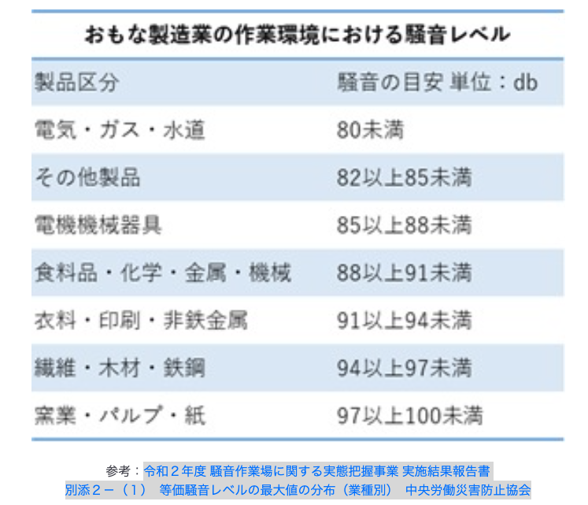
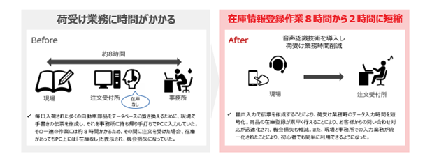
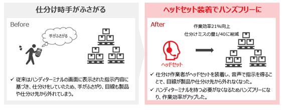

# hands_free

---
▫️音声技術調査
- VOSK (Apache 2.0)
    - https://alphacephei.com/vosk/models?utm_source=chatgpt.com
    - vosk-model-small-ja-0.22.zipのモデルのzipファイルと、それをダウンロードする用のhttps://cdn.jsdelivr.net/npm/vosk-browser@0.0.5/dist/vosk.js"
    - vosk-model-small-ja-0.22
        - html+jsでできる構成で試した。small版はサイズが48MB。認識精度はchrome標準搭載の音声認識APIより大きく劣る。却下。
    - vosk-model-ja-0.22
        - html+jsでできる構成で試した。サイズが1GB。処理が遅すぎる。とても実運用で使えない。
        - pythonで試した。かなり誤認識が目立つ。これも使えなさそう。
        ```py
        --- 読み上げてください ---
        python3 - <<'PY'
        import sys, sounddevice as sd, queue, json, vosk, wave
        q = queue.Queue()
        def cb(indata, frames, t, status): q.put(bytes(indata))
        model = vosk.Model("vosk-model-ja-0.22")
        rec = vosk.KaldiRecognizer(model, 16000)
        with sd.RawInputStream(samplerate=16000, blocksize = 8000,
                               dtype='int16', channels=1, callback=cb):
            print('--- 読み上げてください ---')
            while True:
                if rec.AcceptWaveform(q.get()):
                    print(json.loads(rec.Result())["text"])
        PY
        --- 読み上げてください ---
        ん
        
        おはよう
        こんにちは
        百 人 展 を
        ん ６ 点 ご
        ６ 点 ご
        ん
        年 後
        ん 間 に
        ん と 思い
        ん ひどい 出 遅れ
        ん
        ん ０ 点 名 郷
        ん ６ 点 に 号
        ん 百 号
        ん 七十 号
        ん 六十 五
        ん 二十 二 点 ６
        ん ３ 点 １
        ん いち まる ご
        ん 百 さん
        ん
        ```
- whisper
    - whispercpp(large)
        - https://huggingface.co/ggerganov/whisper.cpp#openais-whisper-models-converted-to-ggml-format-for-use-with-whispercpp
        - かなり遅い。普通のノートPCでは使えない
        - whisper.cppはPythonじゃなくて、C言語で書き直し、ガチガチに最適化してる。無駄な重い処理を全部カット。
        - 精度はそのまま、軽量・高速マシン用に鬼チューニングしてある
- Google Cloud Speech-to-Text(Google音声認識API)
    - 商用利用可能
        - https://cloud.google.com/terms
            - 1.1 Services Use〜の部分
        -　https://moonlightdx999.hatenablog.com/entry/2019/02/03/120000  
    - 料金は従量課金制
      - https://cloud.google.com/speech-to-text/pricing
      - （例: 標準モデルで音声1分あたり約0.016ドル＝約2円​
      - 利用した分だけ低コスト化
  　- 検査A（日常点検）
        - 検査項目が300
        - よって発話数が300回＊発話時間(3秒) = 900秒 = 15分
    - 検査B（車体の検査）
        -  検査項目が97
        -  よって発話数が97回＊発話時間(3秒) = 291秒 = 5分
    - よって1日の音声入力時間/人 = 15 + 5*n(回)
    - 検査Bを1日3回やるとすれば
        - 15 + (5×3) = 15 + 15 = 30分
        - 1日あたり30分のAPI利用時間
    - 月間API利用時間（分） = (15 + 5×n) × 20
        -　30 * 20 = 600(分)
        - 作業員1人あたり月600分（＝10時間）**くらい音声認識API使う想定
    - 600分 × $0.016/分 = $9.6
    - $9.6 × 10 = $96/月（日本円で約1万5000円くらい）
    - $9.6 × 50 = $480/月（日本円で約7万円ちょっと）
- PCスペック
    - M3チップ搭載
        - Appleが作った最新の頭脳（CPU）。今までのM1・M2よりさらにパワーアップしてる。
    
    - 8コアCPU
        - 頭脳（CPU）が8個ある。簡単に言うと「同時にたくさんの作業をこなす力」がある。
    
    - 10コアGPU
        - 画面をきれいに動かすグラフィック専門の頭脳（GPU）が10個。動画編集とか画像編集にも強い。
    
    - 16コアNeural Engine
        - AI系（顔認識とか音声認識とか）を超速で処理できる専用回路。未来っぽい機能のためのエンジン。
    
    - 24GBユニファイドメモリ
        - 作業机の広さ。普通の人は8GB〜16GBくらいだけど、24GBはかなり広い。重い作業も余裕。
    
    - 512GB SSDストレージ
        - データをしまっておく倉庫の広さ。そこそこ大きめ。写真・動画たくさん保存できる。


▫️懸念
・タブレットor PC？
→タブレットだと充電消費激しいかな？ずっと音声流れるし。
→タブレットでブラウザ推論の場合、消費激しいのでは？
・タブレットの場合、充電の減り、どこで充電するか。推論する場合は消費激しいのかも？
・サーバで音声認識処理する場合、作業者が多くいる時にレスポンス遅くならないか
・サーバで音声認識処理する場合、サーバのスペックはGPU？てかGPUとかありなの？
・

---
## 課題
- 製造現場でのノイズ対策

- ベテラン作業者からするとOK,NGなんてのはタブレットぽちぽちしたほうが圧倒的に早い
- 来場予定者
    - トヨタグループ各社
    - (自動車分野以外の技術であっても、応用可能性があれば出展可能)

- 両手が塞がっている、
    - 重量物や大きな部品を手で支えているような工程など
    - 足場が不安定、高い場所で危ない場所で、タブレットに目線がいくのが危険
- 手袋をつけていてタブレットを頻繁にタップしづらい
- 手が汚れやすく、画面に汚れ・傷がつきやすい
- 衛生面が厳しい現場で、消毒が必要
- 視覚に制限がある人
- 自動車業界
```txt
企業・業種: 自動車メーカー（例: トヨタ、ホンダ、日産）や大手サプライヤー（デンソー等）。
具体的状況: エンジンや変速機の組付で、重量物を両手で支えて固定しながら作業する場面。
組立や検品チェック項目が「寸法OKか？ トルクOKか？」など細かく存在。
その都度タブレットを置くか片手を離す→重い部品を一時クレードルに戻す…といった手間がある。
音声で「トルクチェック合格」と言うだけで記録されるなら、部品を持ち直す回数を減らせる可能性はある。
```


- 自動車製造業界での需要
    - リストや端末などを手に持つ必要がない
    - 両手で作業を行うことができます
    - 重量物の検品
    - 情報の確認や入力も全て音声で行うためアイズフリーの状態で作業可能
    - 数値を目で確認しながら読み上げ
    - 記録のために筆記用具を持ったり、記録用デバイスに触る必要がないため、手を止めることなく記録することが可能になります。作業時間を大幅に削減するほか、記録の転記も不要になるため、転記によるミスも防ぎます。
    [test](https://www.cross-docking.com/service/voice-system/){:target="_blank"}

    - 車両の建付けを行う監査業務は、計測を行って手書きで数値を記入し、あとから改めてパソコンでデータを作成していました。音声入力により、入力ミスや時間のロスを解消
    - 120か所の測定作業の時間が3分の2に。身体的負担も軽減
    - 監査業務では、120か所を測定しますが、1か所測定するたびに作業台まで歩き、手書きでチェックシートに記載をしていました。そのため、これまでは1台あたり120分の時間がかかっていましたが、音声入力の導入により80分に時間を短縮することができました。車両とチェックシートの往復も無くなり、身体的負担も軽減できました。誤ったデータを入力した際も、アンサーバックで確認ができるので、早い段階で間違いに気づき、測定しなおすことができるため、修正時間を短縮できました。
    - 「0.2」と音声入力すると、「0.2」と返答することで入力値の確認(合っていれば「次」と音声入力して次へ行く)
    - 入力値はエクセルに反映される
    - 検査現場では検査結果を手書きしてPC入力していた→入力ミスや時間のロスを解消したい
        - 車の部品まで移動→メジャーで測る→デスクまで移動→紙に記入→数百箇所繰り返す→最後にPCに再度入力
        - オペレータの身体的な負担も軽減
    - PC1つマイク1つでシンプルな作りで導入する側もイメージしやすく安心
    - 完成車ボディの建て付け寸法検査は，各パネル部品の. 組み付け寸法を検査するもの
    - できるだけ短いワードで入力制御したいかも（次、OKとか。）
    - 実際に導入前と導入後で何分の時間の短縮ができたかはアピールになる
    - この会社では車の組み付け寸法検査に導入したが、さらに横展開できるのではないかと検討中らしい
    ```txt
    製造現場では検査結果を手書きしてからPC入力と言うことを行なっていたため、入力ミス、時間のロスを解消したいと思っていた。
    PC1つとマイク1つと言うことで使う道具が少なく、とてもシンプルで好印象を受けた。
    音声を実際に入力してみると数字も入る
    アンサーバックも聞き取りやすい
    主に監査業務の車の建て付け測定がある。その業務で苦労していた「計って記入する」「記入したデータをまたPCに打ち込む」と言う業務に導入
    車両を図ってチェックシートに記入すると言う作業を120回繰り返していたところをPC入力できる、さらにExcelに入力できると言うところで
    車とチェックシートの往復がなくなり身体的負担減る
    オフラインということと、道具を選ばないので他作業でも横展開したい

    建て付け測定とは、ドアや窓などの開閉できる建具の建て付けが適切であるかどうかを点検する作業です
    建て付け測定では、次のような項目を確認します。
    ドアや窓の上端部とリテーナの間隔
    ドアや窓の後端部とリテーナの間隔
    ドアや窓のガタツキや垂れ下がり
    ドアや窓の開閉時の異音
    ラッチの動きやネジの緩み
    丁番の隙間や部品の脱落

    ```
    [岐阜車体工業株式会社様](https://amivoice-keyboard.amivoice.com/akb/win/case/01/){:target="_blank"}

    - プリンティング・ソリューションズ・ジャパン株式会社では、オフセット印刷用ブランケットの加工・販売を行っています。 以前はブランケット厚み測定の際、四つ角の厚みの精度測定を行うにあたりキーボードで数値を入力していましたが、業務の効率化のため、音声で入力する音声認識キーボード入力システム「AmiVoice Keyboard」を導入いただきました。
    - 印刷機に使うゴム状のシートの4つかどの厚みを測定
    - デスク上でマシンを使って両手を使い4点？を測定→右隣にあるPC体を向ける→キーボードで手入力→また正面向いて両手使ってマシンで計測
    - 導入後→両手で計測しつつ音声で数値入力→横にあるPC画面チラ見して値確認
    - 超指向性型マイクなので騒音環境下でも快適に音声認識をご利用いただけます。
        - マイクがどの方向から音を収音できるかという特性のこと
        - 指向性とは、マイクがどの方向からの音を拾いやすいかを表した特性のこと
        - 無指向性 無指向性のマイクはどの角度からでも同じ感度となり、カバー角度は全方向の360°で環境音を最大限に収音します。 そのため、複数人が集まる会議などを録音する場合に適しています
        [指向性マイクに関して](https://www.borderless-tokyo.co.jp/borderlessseminar/chisiki/shooting/sc014.html){:target="_blank"}
    [プリンティング・ソリューションズ・ジャパン株式会社様](https://amivoice-keyboard.amivoice.com/akb/win/case/02/){:target="_blank"}

    - 両手使って車の性能検査して→何かしら紙とかキーボードで入力しに行って→また戻って検査してって現場は使えそう
---
## 改善点
- 入力値を返答
- 返答が間違っていれば再度入力
- 箸とかスプーンとか小物の検品はパパパパって高速に見るので音声の案内は遅すぎていらないが、検査にある程度時間がかかるもの（自動車の機能検査、実際にワイパー動かすとか、ブレーキの効き確かめるとか）には使えそう
- 読み上げスピードは変更できるか。
- 一定時間入力がないとどうなるのか。
- 辞書登録？
- 規定外の数値や値の入力を防ぐ

- 右上: 進捗バー（50%完了など）
---
## 要件定義
■要件定義
1.背景と目的
背景: 製造現場や品質管理の現場では、作業員が手を使わずに（両手が塞がっている状態でも）品質チェックを行いたいというニーズがあると仮定
目的: 音声読取・生成APIを活用し、作業員が検査結果を音声ベースでやりとりできるアプリを開発することで、手を使わずに品質チェック作業を完了できるようにする。

2. スコープ
対象業務: 製造工程や検品工程における品質チェック
点検対象: 車両の寸法測定、車両の機能検査(ワイパー動作確認、ブレーキ機能確認)、
  点検対象の特徴
  両手を使い検査する
  1つの検査項目に対して一定時間掛かる
  項目毎に検査結果を記録する
3. 機能要件
3.1. 音声生成機能
    1. 項目の音声案内  
         チェックリストの各項目を、自動的にテキスト→音声変換して読み上げ。
        （例）「次は外観検査です。キズや汚れがないか確認してください」等。
        （例）「次は外観検査です。キズや汚れがないか確認してください」等。
        （例）「項目A」等。
    2.音声入力後のアンサーバック
        音声入力後、入力値がそのまま読み上げられ、入力値が正しいか確認。
3.2. 音声認識
    1. 音声入力での検査結果入力（数値など）

       作業員が「0.2」「28.5」と発声するとシステムに記録される。
    2. 音声コマンド
       「次」「やり直し」「終了」などの音声コマンドでアプリを制御。
3.3. 結果記録機能
    1. チェック結果の保存
       作業完了後、音声入力結果をテキスト形式で保存。
3.4. ユーザーインターフェース（UI）
1. 音声案内と同期した画面表示
    音声合成で読み上げている項目を画面に強調表示、作業者が視認できるようにする。
    音声入力結果がリアルタイムで画面に反映される
    点検対象の全体図画像を表示し点検中の部分を強調表示させる(余裕あれば)

4. 運用フロー
    1. 作業員がアプリを起動し、「チェック開始」を音声やタップで選ぶ
    2. システムが音声ガイドで項目を読み上げ、作業員が検査結果（測定数値、OK、NG）を回答
    3. 1つ1つの検査項目が完了時、「次」と回答し次の項目へ進む
    4. 全項目完了後、結果（数値、コメント）に保存
    5. 入力結果確認画面表示、編集可能。

5. 環境・使用技術
    言語:html, Javascript, css(余裕があればフレームワーク等でデザイン調整)
    サーバ/DB: 保留(時間次第。マスタ情報等はjsファイルで固定値で一旦保持する)
    音声生成API: Web Speech API
    音声認識API: Web Speech API 
    マイク: 単一指向性マイク(ヘッドセット)
    (ノイズキャンセリング機能付きが望ましい)
■実際の展示手順
①寸法測定業務フロー実演（音声入力導入前）
    1.車の各部位まで移動
    2.メジャーで採寸
    3.デスクまで移動
    4.紙に記入
    5. 1に戻る
    6.最後にPCに再度入力
②寸法測定業務フロー実演(音声入力導入後)
    1.車の各部位まで移動（ヘッドセットマイク装着）
    2.メジャーで採寸
    3.計測結果を音声入力
    4.「次」と回答し次の検査項目へ進む
    5. 1へ戻る
③　①と②の経過時間の差から業務削減時間を提示
■できない部分・カバーできない部分（信頼につながる）
    NG理由など、自由入力の場合に、どうしても誤字で記録される場合がある・
    対応言語
    「えっと」「あのー」などの言い淀み（フィラー）も認識し記録する？

## 雑多な情報収集
エラーといってもその内容については様々な種類があります。

やり忘れ（すべきことをしなかった）
やり間違い（すべきことが違っていた）
余計な事（やってはいけないことをしてしまった）
順序違い（やることはあっていたが順番が違った）
タイミングが悪い（やるタイミングが適正でなかった）
知識・技量不足（正しい方法でやったつもりだができていない）
人間だれしも意図的にエラーを起こそうとは思っていないケースがほとんどです。（中にはそうでない場合もあるかもしれませんが。）
それにもかかわらずエラーが発生する背景には下記のような要素がからんできます。

能力の限界　（集中力の欠如、記憶力の限界、視野・聴覚の限界）
錯誤　（ベテランが陥りやすい思い込みによる間違い）
失念　（単純に忘れた）
参考： ヒューマンエラー　第３版　小松原　明哲　著　丸善出版

エラーが発生している状況を確認すると下記のようなケースに発生している場合が多いようです。
列挙した状況をながめているだけで、なんとなく危ない雰囲気がただよってきますね。

いつもと違うことをした
難しいことをした
同じような場面で直前に違うことをした
紛らわしいものを扱った
後まわしにした
急いでいた
忙しかった
緊張していた
注意し続けていた
疲れていた
参考： ヒューマンエラー防止の心理学　重森 雅嘉　著　日科技連出版社

原因や状況がどうであれエラーが発生してはいけません。
特に製品の最終検査の段階での見落としは市場に瑕疵不具合を流出させ、致命的な結果につながってしまいます。
お客様からのクレームを受けるだけならまだしも、最悪の場合リコールや損害賠償につながることもあります。」

音声検査システムには、ヒューマンエラーを防止するために必要な要素がそろっていることに注目してください。
例えば指さし呼称、確認する際に単に“ＯＫ”や“はい”と回答するのではなく具体的な状態などを回答させるような流れにすることにより指差しした対象物を確実に見て回答することが徹底できます。電車の運転士さんに　“信号は？”　という質問をして　”OK”と回答するのではなく　”アオ“　と回答させるといった具合です。
またダブルチェックも、読み上げを人の代わりにシステムが行えます。
単に二人の作業を一人で行うことが可能となるだけでなく、あらかじめエラーが発生しやすいポイントについては注意事項や確認事項を事前に設定しておくことにより、誰が行ってもその注意事項を必ず聞いたうえで作業が実施できます。
誰が行っても同じ結果が期待できるということは、今後ベテランの作業員が高齢で退職しても新しい経験の浅いスタッフがベテランと同じレベルで作業できるということです


音声認識技術の導入を検討において従来ネックとなっていたのは作業現場の騒音環境です。
シーネットの音声認識システムに採用されている音声エンジンAmiVoiceは、90dBの騒音下でも認識可能です。以下の表は主な製造業の作業環境における騒音レベルの目安と、日常生活における騒音レベルの目安の一覧です。
端的に言えば、90dBの騒音とは、パチンコ店内やゲームセンターなど、声を張らなければ意思疎通ができないほどの騒音下でも、使用することが可能ということです。
一般的な事務所での認識精度については実際にシーネットの音声検査システムLISTESTを導入されたENEOS株式会社様川崎製油所品質管理グループでのテスト結果をご紹介します。導入前に現場で行った800回のテストのうち、１回のみ誤認識（0.125％）がありました。
実運用にあたっては問題ないという判断のもと、現在問題なく運用されています。



・音声システムからの作業指示（アウトプット）に基づく作業により決められた手順を遵守可能
・ハンズフリー・アイズフリーの作業によって作業効率向上、作業品質向上
・誰が行っても同じ手順を徹底できるため、属人性から脱却し標準化を実現
・作業者の音声による結果入力（インプット）によって入力工数を削減
・作業と同時にデータが登録でき、リアルタイムに作業状況を可視化
・タイムスタンプつきのログデータにより作業履歴のトレーサビリティを実現


エビデンスマネジメントを実現
音声システムは、作業効率を向上させるだけでなく作業品質の向上や作業者による作業レベルの均質化も可能な現場業務に最適なシステムと言えます。
 
・物流現場での仕分け（種まき／摘み取り）作業、入出荷検品作業
・製造現場での原料検査・試験・分析作業
・製品出荷時の瑕疵・不備・機能検査作業
・設備や機器メンテナンス現場での点検作業
・その他SOP（Standard Operating Procedure：標準作業手順書）に基づいて行う作業

トレーサビリティとは、製品の原材料の調達から消費までの過程を追跡できる仕組み


意外な関心事項：【騒音下の認識精度】がNo1
現在の検査業務：
アンケート回答者の58％が［チェックリストに記入後PCに入力］と回答しており、まだまだ従来ルーチンでの業務が残っていることが伺われます。
最も参考になった内容：
一番参考になった内容は［認識精度］でした。 多くの方が音声認識精度について一昔前のイメージを持たれていたようです。現時点での音声認識精度について驚くと同時に現場でも使えるレベルになったことを認識して頂きました。システムの機能・特性だけでなく実際に現場で使い物になるという点をきちんとお伝えすることの重要性を再認識しました。


参加者の声：【手作業からの脱却】が当面のテーマ
検査システムの改善について

検査結果を自動で整理し、自動で分析表が出せるシステムなど好ましく思われています。
検査結果とシステムとの自動連係検討をしている
検査機器からのデータをPCへ連携させ、社内のネットワークシステムへ入力する仕組みを一部取り入れていますが、多くの作業で用紙への記入とPCへの転記入力が残っています。
手書きのチェックリストが多いのと、選択肢ではなくて自由入力部分もあり、検査後に思い出しながらの記入等で、記入忘れや時系列が不明瞭になることがあり、リアルタイムに出来事を記録できる方法は無いかと考えている。
分析機器とのLIMSの接続
検査データ伝送システム構築中
入力の省力化、負担軽減。但しエビデンスは必要なので、バランスは必要
検査　計測　データ転送の自動化　機械化
検査システムの改善について

計測結果を転記ではなく写真にて残すこと。転記ミスのリスク低減策として容易に導入できるため。
音声認識のレベルが騒音化でもここまで良いとは思っていませんでした。また、ステップ毎の確実なチェックが可能なのでSOP遵守には必要と思われます。
具体的な導入事例です。今後、近いうちにDXの波が工場にくるわけだが、人事や総務・営業だけでなく製造部門にも広がっていくと推測する。そういった意味ではIOTを基盤にシステム化していくことになるが、より効率化やスマートを目指すとなれば今回の音声認識システムの導入が不可欠になっていくと思われるので。
騒音下でも音声入力を精度良くできる点は技術の凄さを感じました。
作業ログの記録、および、プログラムレスが参考となった。作業ログの記録は、作業手順逸脱防止にもなると考えられる。カスタマイズできる点も良いと思う。
手作業、目視確認についてはチェック用紙へ記入することがメインとなっているため、まじめに作業しようとすると操作⇒チェックリスト⇒操作⇒チェックリスト⇒・・のようなことをしなければならないため、チェックリストへのまとめ記入（予め記入）などの不正が起こりやすく、それが原因でチェックミスのリスクが高い状態になりやすいと考えており、その一つの解決策として参考になりました。
システム開発会社の者です。製造業様向けに、紙による指示やペーパーレス化、端末による実績収集などをご提案してきましたが、音声を使った方法がある事を知る事ができました。また、現在の音声認識が非常に高い精度にある事も、今後の提案に向けて参考になりました。
騒音の中でも認識が出来てきていること。読み上げスピードが大分上がることがわかった。
騒音に対してのフィルタリング機能のあるハードウェアの存在。騒音下や複数人数での使用が多いと考えられる。
クラウド型は初めて聞きました。
しっかりした業務フローとして導入されているところ。
音声ガイドと対話しながら試験を行うことで、記録が残せる。
ENEOS川崎製油所様における実例を拝見できた件　実際の音声と作業の連動を見ることができ、イメージがつかめた。
騒音化での音声の判別能力のレベル
音声による文字おこし、騒音に強い、音声ガイド、写真によるデータ認識
ENEOS様の導入紹介　実際の使用場面がイメージできた
最後の検査での活用事例　音声入力、そのデータ撮影　これらは連携保管？
音声認識の最新状況を知ることができました。ユーザーの実例も大変参考になりました。
読み上げた測定値が品質情報管理システムに入力される内容が参考になりました。測定値記入、および品質情報管理システムへの入力にかかるダブルチェックが不要となるので、大きな労力削減が見込まれます。


今回のセミナーでは、製造業の皆様の音声認識に対する期待、および検査業務を改善していこうという意向が明らかとなりました。

音声検査システム導入により可能なこと

90dbの騒音下での音声認識　
音声ガイダンスにより作業手順逸脱を防止　→作業指示がある現場で有用
プログラミング不要で作業手順の音声ガイダンスを設定→アプリ内でカスタマイズできる
作業ログにより作業履歴を可視化・確認・記録→履歴ってどんな時に役立つんだろう
RPAやLIMPなど上位システムとの連携→これはなんのメリットがある？
手入力作業からの脱却


業務のシステム化の際に、音声システムのほかに検討したシステムはありますか？
A： 特にありません、現在はRPAも使い効率化をすすめています。（ENEOS）

Q： 標準的な導入リードタイムはどのくらいですか？
A： 導入される現場のサイトサーベイなどに基づいて算出いたします。（CNET）

Q： 導入費用はいくらぐらいですか？
A： 月額9万円から提供しています。別途初期設定費用、機器費用、回線費用が必要です。（CNET）

Q： AmiVoiceやLISTESTは防爆エリアでも使用は可能でしょうか？
A： 防爆対応のPDA(AndoroidO/S）にて音声エンジンが問題なく使用できれば大丈夫です。
   現時点では検証済の機器はありません。（CNET）

Q： 先⽇のUSAでの⻯巻による災害では、携帯電話を持ち込めない⼯場や倉庫で使用者が多く出て
　　いるという報告もあります。このようなデバイスから、緊急連絡は取れるのでしょううか？
A： PDAのアプリとしてコミュニケーションツールを動かすことにより可能です。
   本⽇紹介した検査システムのアプリでは⼀⻫同報や端末間の会話などはサポートしていません。（CNET）

Q： 作業中の確認でＮＧがでたときも音声システムに沿って対応可能なのでしょうか？
A： 音声シナリオの設定次第でいかような対応も可能です。（CCS）

Q： マイクは、どのような騒音下まで対応可能でしょうか？発表では90dBとのことでしたが。
A： 現場環境により精度が影響を受けるので、実際の現場でテストすることをお薦めしています。
   現場で事前に導入前にチェックすることをお勧めします。（AM）

Q： ENEOS様での使用現場は品証で紹介されていましたが、その他プラント現場での使用もあるのでしょうか
A： 他社での利用事例はまだありません。今回のセミナーは新製品の発表も兼ねております。（CNET）

Q： ENEOS様の発表の導入後の動画中、iPodで撮影された写真データは音声入力された
   試験データと紐づいて自動でサーバ等へ格納されているのでしょうか
A： そのとおりです。試験番号毎、製品毎に画像データをダウンロード可能です。（CNET）

Q： 音声認識ミスの発生率はいかがでしょうか？また、音声読み上げや音声入力のスピードは、速くなりますか？
   (動画では通常会話レベルより、若干ゆっくりに感じました)
A： 読み上げのスピードは都度端末で変更可能、シーネットの端末では［読み上げ速く］と発声することで
　　スピードを上げられます。（CNET）
   現場では400回テストして1回発生、想定していたより認識精度が良かったので採用しました。（ENEOS）
   音声認識のスピードは端末のスペックによります。（AM）

Q： クラウドサービス導入にあたってセキュリティ面についてはどの様にクリアされたのですか？
A： 音声システム用の無線ＬＡＮ環境を社内ネットワークとは切り分け、弊社セキュリティ規定に基づき
　　導入しました。（ENEOS）

Q： ⽇本語以外も検討されていますか？
A： 現在は⽇本語対応のみです。（CNET）

Q： WT-01の導入前のトライアル貸出機はありますでしょうか。販売代理店によりますか？
A： WT01の貸し出しは可能です。詳細は担当営業にご相談ください（CNET）

Q： 導入検討のためのモニタ利用は可能ですか？
A： 可能です。 詳細は担当営業にご相談ください。（CNET）

Q： PDAを使用した音声認識システムはどのような業務をされているところに向いてますか？
A： 現場作業を行いながらの業務（立ち作業、動きのある作業、作業環境がPC操作に適していない、など）
　　に適しています。（CNET）

Q： ⼯場内に無線LAN環境がない場合は使えないのですか？
A： LTEにてクラウドに接続できれば利用は可能です。（CNET）

Q： 上位品質管理システムとの連携で注意すべきことはありますか？
A： 試験装置から直接通信していた実績があり、音声システムとの連携もそれと同様の形で実施したので
　　特段注意すべきことはありませんでした。（ENEOS）

Q： 複数台で、同時にいくつか使用した場合に、機器の間で音声の誤認識が発生しない⼯夫はありますか？
A： 指向性の高いマイクを使用しているためマイクを装着した人以外の音は基本的に認識しません。
   万⼀隣の人の音声を認識してしまう場合はマイクの感度を調整することにより問題は回避できます。（CNET）


作業を進めるだけでリアルタイムなトレーサビリティが実現
また、単に指示が間違いないだけでなくシステムからの指示に基づき行動した結果を音声にて入力することも可能です。
一連の作業指示と実行結果がすべてシステムのログとして残ります。
このシステムを利用すると作業のトレーサビリティが自動的に管理できてしまうということになります。
従来の紙によるチェックリストは記録には残りますが、いつチェックしたかという時間軸の情報にあいまいな部分が残ります。
タブレットＰＣなどを利用した場合、履歴を残したいポイントの分だけ入力工数が増えてしまうマイナス面が発生します。 その点、音声システムを利用した場合は作業指示とそのレスポンスを行っている間に詳細作業履歴データが取得できてしまいます。

- 作業履歴のメリット
作業者と管理者双方にメリットのあるシステム
作業履歴データは単に`作業手順を間違いなく行ったというエビデンス`としての利用だけでなく、`作業工程の中で誰もが時間がかかってしまう工程を発見することも可能`です。
また、`スタッフによっての作業時間のばらつき`や、`通常時との差異を分析することによって作業工程や指示の改善、スタッフの能力変化などを把握することも可能`です。
当然のことながらこういったシステムで`全ての行動が把握されているということ自体が作業者に対しての管理レベルの向上につながります`。
もちろん`作業者自体は以前よりも簡単に、間違いのない作業ができるようになるため業務に対するストレスレベルも下がりますので、双方にとってメリットのあるシステム`と言えます。


音声システム利用のメリットまとめ
音声システムを利用した作業のメリットは下記のとおりです。
１． 誰でもいつでも決められた手順による作業が実行できる。
２． 手順書やＰＣ画面を確認する必要がないため作業効率が上がる。
３． 視線が対象を注視したまま作業ができるため作業精度が向上し、エラー発生率が低減する。
４． 作業履歴のトレーサビリティが取得できる。


多様な場面で自動化過渡期のヒューマンエラーを撲滅
これらの効果は作業現場におけるヒューマンエラー撲滅のための有効なツールとなることは間違いありません。
作業を完全に自動化することが究極の目的であることは間違いありませんが、一部を人手で行う必要がある現時点においては、いかにヒューマンエラーを撲滅し、人手による作業の品質・効率を向上させるかということが重要です。
音声システムは製造工程、検査工程、準備工程など様々な場面で、品質向上・作業効率向上に役立つ仕組み作りとして利用できます。


導入の効果はいかがですか？
作業時間の大幅削減！
データ入力ミスの軽減！
音声入力は斬新
最初はどのように使えるか半信半疑でしたが、実際に使ってみたら画期的！しゃべった声がそのまま画面に入力されていくので、 図面から目を離すことなく作業ができますし、音声を認識すると復唱されるため、耳で聞いて入力チェックもできてしまいます。 発想の転換が大事だと感じました。
音声入力は確実でミスがありません。
検査表を作成する段取り時間は４割短縮でき、大きな効果が得られました。
活用範囲の拡大
金型製造部門の検査表作成工程だけでなく、量産を行っているコネクタ部門でも導入し、検査結果入力作業の効率化を実現しています。


AmiVoice Keyboardの辞書登録機能（ワード登録しておくと全部を読み上げなくても一括入力できる）が便利と伺いました。 早速使って効果を試してみたいと思います。他にも担当者の声を覚えておいてその担当者であれば必ず認識するような機能等、より使い勝手がよくなるよう機能の拡充に期待しています。
また、検査部門に限らず他部門にも活用領域を広げ（単純なデータ入力を行っていて音声認識が適している作業）、会社全体で合理化の推進、付加価値の向上につなげていきたいと考えています。


【導入の背景】
・社内DX推進の一環として、検査記録の作業効率化を検討
・手書き・紙ベースでのデータ管理による検査の非効率さが課題
【導入の効果】
・音声認識の活用により、検査しながらExcel（※）へのデータ入力が可能に
・マクロの活用や規定外の数値入力を防ぐ仕組みの構築により、データの信頼性が向上
・検査データをデジタル化したことで、情報の検索がスムーズになり、作業効率を大幅に改善
・既存の測定器を活用した音声入力が可能なため、優れたコストパフォーマンスを実現。


＜入荷＞<br>音声認識技術を導入し、荷受け業務時間が大幅に削減
続いて、荷受け業務の時間短縮につながった事例を紹介します。
【課題】現場で手書きの伝票を作成し、
それを事務所に持ち帰りPCに入力するため時間がかかる
日々多くの部品が入荷されており、それらをデータベースに反映させるために、現場で手書きの伝票を作成し、事務所に持ち帰り手打ちでPCに入力していました。数が多いこともあり、データベースへの反映には非常に長い時間が必要な状況でした。
さらに、データベースへの反映中に発注を受けた場合、在庫があったとしても、データベースの反映が完了していないため、「在庫なし」と表示され、機会損失につながっていることも少なくありませんでした。
【改善策】音声入力で伝票を作成
現場で行なっている伝票の作成を音声入力化することで、荷受け業務時のデータ入力時間の大幅な短縮に成功しました。
製品の在庫登録が素早く行えることにより、従来よりもタイムリーに在庫状況がデータベース上に反映されるようになったため、顧客からの問い合わせにもスムーズに対応できるようになりました。
【効果】荷受け業務時間が大幅に削減
音声認識技術を用いた音声入力を採用したことで、荷受け業務に費やされていた時間が大幅に削減され、さらに機会損失の軽減にもつながりました。
音声認識で作業効率化を図る事例紹介



ハンディターミナルとハンディスキャナの違い | ハンディ ...
手で持って使うバーコードリーダが「ハンディスキャナ」、さらに読み取ったデータを表示・確認・保存・データ送信などを行えるようにした多機能携帯端末が「ハンディターミナル」になります。 ハンディスキャナはPCがなければ機能しませんが、ハンディターミナルは単体で機能するところも大きな違いです。


＜仕分け＞<br>仕分け内容の音声指示方式を導入し、<br>ミス率が大幅に低下
最後に、ハンディターミナルによる仕分けから音声指示方式に変更したことにより、業務効率化を実現した事例を紹介します。
【課題】ハンディターミナルの画面を見て作業するため、作業が止まったり、仕分けミスが発生したりする
本事例の企業では、ハンディターミナルの画面に表示された指示内容に基づき、仕分けを行っていました。そのため、手が塞がり、目線も製品や仕分け先から外れてしまうので、業務の効率や正確性に課題がありました。
【改善策】仕分け作業者がヘッドセットを装着し、音声で指示を得る
課題の解消として、仕分け作業者がヘッドセットを装着し、音声で指示を得る方法を採用しました。ハンディターミナルを持つ必要がなくなるためハンズフリーになり、作業効率がアップし、目線が製品や仕分け先から外れなくなったことで、ミスのリスクも軽減されました。
【効果】ハンズフリーになり、作業効率がアップ。ミスの削減につながる
ハンズフリーとなったことで作業効率が向上し、さらに、仕分けによるミスの量は大幅に低下させることができました。
音声認識で作業効率化を図る事例紹介



単語登録機能比較
Nottaには、使用頻度の高い単語を登録できる機能があります。単語登録機能は、日本語の文字起こしでのみ利用可能です。フリープランでは3個、プレミアムプランでは最大200個まで単語を登録できます。
利用方法は簡単で、難しい設定などは必要ありません。人名や専門用語、企業名などの「読み」と「表記」を事前に登録することで、文字起こしをする際の変換精度が上がるでしょう。
- 音声入力中の項目を強調表示する✅
- 音声入力後、アンサーバックする✅
- 音声入力した値が画面に反映される ✅
- 入力済みの項目数に対応して進捗バーが進む✅
- 音声案内が最後の項目を処理次第、結果確認画面に遷移する。

音声入力後アンサーバック✅
音声入力中の項目を強調表示（border等）✅
■音声入力中の項目へスクロール移動するよう制御 ✅
- 音声入力中の大項目のアコーディオンを開く。それ以外は閉じる(優先)✅
■cmの表示
■進捗バーの上部固定（余裕あれば）
■数値入力欄の最低限の長さ（余裕あれば）
■入力値はセッションなどに保存し、画面遷移後もそれを元に値表示。(優先)
☑音声入力値のバリデーション(優先)✅
☑完了項目数に応じて進捗バーのstyle:width 〇%を上書く✅
- 一回目の音声入力が文字になる✅
- 未入力で進んだ時に、進捗バーが進んでしまう。
■音声の声質✅
■アプリの立ち上げはライブサーバー？
■値の受け渡し
■検査項目Aに加えてINFOボタンや詳細の表示があるといいかも（余裕あれば）
■大項目Aのよこっちょに進捗完了or未完や、何個中何個終わったか書いておく？（余裕あれば）

■展示会場ではノイズキャンセリングマイクを使って音声入力しないとまずそう。


✅音声入力中の項目を強調表示する
✅音声入力後、アンサーバックする
✅音声入力した値が画面に反映される
✅入力済みの項目数に対応して進捗バーが進む
✅音声入力後アンサーバック
✅音声入力中の項目へスクロール移動するよう制御 
✅音声入力中の大項目のアコーディオンを開く。それ以外は閉じる
✅音声入力値のバリデーション(優先)
✅完了項目数に応じて進捗バーのstyle:width 〇%を上書く
✅音声の声質
✅進捗バーの上部固定（余裕あれば） 
✅編集ボタン
✅検査項目AtokaBとかではなくて、実際の車両の部品の名称にした方がいい(優先)
✅結果確認画面の列幅のずれ（優先）
✅入力値はブラウザで保持し、画面遷移後もそれを元に値表示。(優先)
✅cmの表示
✅結果確認画面の項目も具体的な値にする
✅入力数値の合格不合格がわからない。合格だったら緑色(優先)
49~51cmの間で合格なら50なら緑にする漢字。その範囲外ならカードも赤くした方が視認性が良い
✅数値が小さい。ぱっとみでわからない。強調（優先）
✅一回の音声入力で自動で次に行く（優先）
✅タスク一覧画面にもっとタスクを増やす。

✅誤入力の時だけ「戻る」といって戻る（優先）
✅音声の種類変更。
✅↑の音声が本日のタスク画面から遷移後にデフォルトになる。
✅なにかしら作業中断する場合有るので中断機能。（できれば）
✅アンサーバックが消えている
✅完了したらタスク一覧画面に飛んで開始ボタンを完了済みかつ非活性にする。
■許容範囲の具体的な値。現場での許容範囲を調べる。mm単位とか。（優先）

■数値入力欄の最低限の長さ（余裕あれば）
■検査項目Aに加えてINFOボタンや詳細の表示があるといいかも（余裕あれば）
■大項目Aのよこっちょに進捗完了or未完や、何個中何個終わったか書いておく？（余裕あれば）
■一定時間後に音声認識が勝手に終了するので、そこは実作業のときは課題になりそう


■必須任意の項目があるかも。スキップできる
■そもそも誤認識がないように


■夜間作業者向けにダークモード
■方言の対応
■管理サイト(検査項目の追加修正削除)
■写真と連携：「カメラ」と言えば、カメラ起動→不良箇所の写真を保存
■音声テンポ設定機能
■オフラインモード 👉 ネットワークがない工場エリアでもデータ保存
👉 端末内にデータを溜めておいて、Wi-Fiにつながったら同期


食の輸出（食べ物、アワビ）ストーリー性を持たせること大切
北海道
GX
再生可能エネルギー


多言語対応

SLIDO→リアルタイム投稿ツール→製品の質疑応答。スライドゥ

感想をヒアリングしたい（webアンケート取る）
満足度、こういうのが欲しかった等

展示会に向けて整える

お客様の説明の方法を丁寧に。
ぶしつけに案内するのではなく、お客さんの反応見て丁寧に説明する。

田島さん、工程移行判定で社長がslidoってのを使いたいって言ってて、会議後半ですぐslidoをしらべて提案してたので褒められてた。

工程移行

アプリの一連の流れ→残りの改善点
アプリの説明


タブレットで展示するのでどこかしらホスティングする予定


当日の想定される質問に対して質問→こういう場合はどうなの？こういう時は使えるのって質問に対して
（想定質問集を作る）
→これに対してアプリを作るor回答作る
→アプリ8:質問集2で作業する。

このアプリの優位性

ストーリー→こういう導入の仕方出来ます～っていうやつ

真ん中がアジャイル開発
■表示検査項目の具体値、許容範囲の現場で使われる値の調査
■そもそも車の製造現場でどんな工程があるか。
■ヘッドセットorマイクを買う場合は買う候補を調べておく（月曜まで）
→ノイズキャンセリング機能、単一指向性、Bluetooth、機能があれば一旦良さそう。

■ストーリー性（どういった現場で導入できそうか。こういう導入の仕方ができます〜ってやつ）

- ボルト・ナットのトルク検査
    - 概要: 工具を両手で持ってボルトやナットを締め付ける作業。指定されたトルク値に達したかを確認する必要がある。
    - 通常の作業フロー:
        - トルクレンチを使用し、指定のトルクで締め付ける
        - 締め付けた後、目視で確認
        - 記録用シートやタブレットにトルク値を記入
    - 音声入力の活用例:
        - 締め付け後に「締め付け完了、トルク○○Nm」と音声で入力すれば、紙やタブレットへの手入力が不要に。
- ドア・ボンネットの開閉検査
    - 概要: ドアやボンネットの開閉動作を確認し、異常の有無を検査する。
    - 通常の作業フロー:
        - ドアやボンネットを開閉（両手を使用）
        - スムーズに動くか、異音がしないか確認
        - 問題がなければチェックシートに記入
    - 音声入力の活用例:
        - 作業しながら「フロントドア OK」「リアドア 異音あり」と音声で入力し、記録の手間を削減。
- 配線・コネクタの接続確認
    - 概要: 電装系の配線を接続し、コネクタの取り付け状態を確認する作業。
    - 通常の作業フロー:
        両手で配線を取り回し、コネクタを接続
        指定された端子が正しく接続されているか確認
        シートに「接続完了」など記入
    - 音声入力の活用例:
        「配線A接続OK」「配線B接続異常あり」など、両手を使いながら音声入力できる。
- 車両寸法の測定
    - 概要: メジャーやノギスを使い、車体の各部の寸法を測定する。
    - 通常の作業フロー:
        メジャーやノギスを当て、寸法を測定（両手を使用）
        測定値を記入シートに手書きで記録
        記録が終わったら次の測定箇所へ移動
    - 音声入力の活用例:
        測定したら即「全長 4520ミリ」「ホイールベース 2750ミリ」など音声入力すれば、紙への記入が不要に。
- 塗装の目視チェック
    - 概要: 塗装面のムラや傷の有無を目視で確認し、不良があれば記録。
    - 通常の作業フロー:
        ライトを当てながら塗装面を確認（両手を使う）
        ムラや異物があればメモを取る
        不良箇所をリストに記録
    - 音声入力の活用例:
    「左リアフェンダー 小キズあり」「ボンネット異常なし」など、すぐに音声入力すれば記録作業が楽になる。
- エンジン・ブレーキ機能検査
    - 概要: エンジンの始動やブレーキの効きを確認し、異常がないかをテスト。
    - 通常の作業フロー:
    エンジンを始動、アイドリング状態をチェック（両手で操作）
    ブレーキを踏み、効き具合を確認
    結果を記録シートに記入
    - 音声入力の活用例:
    「エンジン始動OK」「ブレーキ制動力異常なし」など、音声で記録できる。
- シートベルト・エアバッグの動作確認
    - 概要: シートベルトの巻き取りや、エアバッグの警告灯のチェック。
    - 通常の作業フロー:
    シートベルトを引っ張って戻るか確認
    エアバッグのインジケーターが正常点灯するか確認
    検査結果をシートに記入
    - 音声入力の活用例:
        「シートベルト巻き取りOK」「エアバッグ警告灯点灯なし」など、即時音声入力。
- タイヤ空気圧・トレッド深さ測定
    - 概要: タイヤの空気圧やトレッドの摩耗度を測定し、規定値内かを確認。
    - 通常の作業フロー:
    空気圧計をタイヤにセットし、測定（両手を使用）
    測定値を記入
    全タイヤをチェック後、作業完了
    - 音声入力の活用例:
        「フロント左空気圧 2.4バール」「リア右 トレッド4.8ミリ」など、測定しながら即音声記録。
        音声入力が適用しにくい作業
- 以下の作業は、音声入力のメリットが出にくいか、音声入力に時間がかかるため、あまり適用が向いていない可能性があります。
    - エンジンの組み立て作業
        一つ一つの工程が細かく、音声での入力が煩雑になりやすい。
        高精度な手作業が求められるため、音声入力が不要な場面が多い。
    - 配線の検査（通電チェック）
        配線の通電確認は作業ごとに細かい判断が必要で、音声入力する時間より手作業でのチェックの方が早い場合がある。
    - 溶接や塗装の工程
        溶接や塗装は連続した作業になりやすく、途中で音声入力するタイミングが少ない。
        作業環境（騒音、粉塵など）が音声入力に向かない場合がある。
    - まとめ
        音声入力を活用しやすい車の製造工程 ✅ ボルト締め付けチェック
        ✅ ドアやボンネットの開閉検査
        ✅ 車両寸法の測定
        ✅ 塗装の目視チェック
        ✅ エンジン・ブレーキ機能検査
        ✅ シートベルトやエアバッグの動作確認
        ✅ タイヤ空気圧・トレッド深さ測定
        これらの工程は**「両手を使う」** & **「記録作業がある」**ため、音声入力のメリットが大きいです。
        この方向で横展開を考えると、音声入力による作業記録の一元化が大きな強みになりそうです。
    - 両手使って作業するが、ただOKかNGかを答えるだけの検査工程だと、だいたいはOKで後でまとめて紙に記入してるとかだと音声入力を1つ1つするのさえ手間かもしれない可能性がある
    - OK、NGを紙でなく電子化することで得られるメリット。というか検査結果を電子化することで得られるメリットは何か
        ```txt
            1. 作業効率の向上
                🔹 紙に記入 → 手入力の手間を削減
                従来は紙に記入 → 事務員がPCでデータ入力 → ミスが発生
                電子化でその場でデータ登録可能
                入力の二度手間がなくなる　
                🔹 音声入力で「OK / NG」を記録
                両手が塞がっていても作業可能
                「次」と言うだけで自動で次の検査項目へ
                「二度手間削減」「紙→PCにデータ入力時の記入ミス」「」
            2. データの正確性向上
            🔹 手書きミス、入力ミスを防ぐ
                手書きの場合「5」と「6」の誤読、0の見落としなどが発生しやすい
                電子化することで 数値のブレがなくなる
                「記入文字の正確性向上」「読みづらさ」「誤読」
            🔹 自動バリデーション
                許容範囲（例：12.0cm 〜 12.5cm）の 範囲外は即NG判定
                手書きでは見落としがちだが、システムなら瞬時にチェック
                「許容範囲をシステムでチェックしヒューマンエラー防止」

            3. 検査データの一元管理 & 簡単検索
                🔹 過去データの検索 & 追跡が可能
                紙の記録は どこにあるか探すのが大変
                データベースに保存することで 「過去1ヶ月のNG率」などを即集計
                🔹 NG率の分析 & 品質改善
                「ドアの開閉 NG率が30% → 設計の問題か？」
                「特定のラインで NG が多い → 作業員の教育が必要？」
                DB に蓄積したデータを分析することで 品質改善のための施策が立てられる
            4. リアルタイム共有 & 即時対応
                🔹 検査データをリアルタイムで共有
                手書きだと、情報共有は 翌日 or 週次ミーティング
                電子化すれば 即時に管理者がチェック可能
                「NG が出たらリアルタイムで管理者に通知」→ 即対策
                🔹 外部システムとの連携
                DB にデータがあると、ERP / 在庫管理 / 製造管理システムと連携
                NG 部品の自動発注 → 欠品を防ぐ
                作業指示の自動調整 → 問題のある部品がラインに回らないようにする
            5. 品質監査対応 & トレーサビリティ
                🔹 監査対応が簡単
                「この部品の OK / NG 履歴を出して」と言われたとき、すぐにデータを検索
                手書きだと 過去の紙を探す手間が発生
                🔹 製造不良が発生したときの追跡
                「NG 率が高かったロットを調査 → 原因特定」
                「過去に OK だったものでも、後から問題が発覚した場合、該当ロットを素早く特定」
            6. コスト削減
                🔹 紙のコスト削減
                紙・プリンタ・インク代
                保管スペース不要（書類を倉庫で管理する手間もなくなる）
                🔹 人件費削減
                データ入力作業の削減 → 作業員が本来の業務に集中
                問題発生時の調査時間を短縮 → 生産性向上
        ```

        ```txt
        2. 従来の検査結果の運用フロー（紙運用）
        🔴 従来（紙ベース）の流れ

        作業者が測定 → 記入シートに手書きで数値を記録。
        検査終了後、事務所に戻る → 紙をまとめて担当者に渡す。
        担当者がExcelなどに転記 → ミスが発生する可能性あり。
        管理者が集計・分析 → 時間がかかるため、問題の発見が遅れる。
        問題が見つかれば報告 → その時点では手遅れなケースも。
        📌 この運用の問題点 ✅ リアルタイム性がない（紙を回収してからデータ化するので遅れる） ✅ 手入力のミスが発生する ✅ 紙が紛失することがある ✅ データが点在するため、調査や分析が難しい

        🟢 電子化した場合の流れ

        作業者が音声入力で結果を記録（リアルタイム）
        システムが自動でデータをDBに登録
        管理者がリアルタイムでデータを確認
        NG品が出たら即アラートを送信
        在庫システム・ERPと自動連携し、必要なアクションを自動実行
        📌 電子化のメリット ✅ リアルタイムにデータ反映（転記不要） ✅ 入力ミスがなくなる（音声入力） ✅ 分析が簡単（過去データを検索できる）

        3. 問題発生時の調査時間を短縮
        従来の紙運用では、問題が起きたときに原因を特定するのに かなり時間がかかる。

        📌 具体例
        ✅ 例1: NG品の特定

        従来 → どの工程でNGが出たのか紙をめくって探す
        電子化 → 検索で1秒でヒット、該当データを一覧表示
        ✅ 例2: NG発生率の分析

        従来 → 過去の検査シートを全てExcelに打ち込み、分析（時間がかかる）
        電子化 → DB上でリアルタイムにNG率を算出し、グラフ化
        ✅ 例3: トレーサビリティ

        「どの部品ロットに問題があったのか？」
        紙運用 → 「〇〇さんが書いたシートどこ？」と探す
        電子化 → 「ロット番号 × NG品の一覧」から即時検索
        📌 電子化のメリット ✅ NG品が出たら即特定できる ✅ 過去データを即検索できる ✅ どこで問題が発生したのか履歴を追いやすい
        ```


■アプリの優位性
・音声技術にAIを取り入れることで現場で使用される専門用語や略語を音声認識システムに学習させることで、認識精度を高め、入力ミスを減らすことができます。例えば、特定の部品名や測定項目を事前に登録しておくと、音声入力がよりスムーズに

・
---
音声認識アプリに対して、ユーザーが抱く主な疑問や不満には以下のようなものがあります：

■認識精度への不満：
ユーザーの73%が、音声認識技術の採用を阻害する主な要因として「精度の低さ」を挙げています。特に、アクセントや方言に対する認識の不正確さが問題視されています。 
JA.KARDOME.COM
ASR技術に対する消費者の不満
2020年の世界調査では、 ユーザーの73％が、ボイステックの採用を阻害する要因の第一位は 精度であると回答しています。

アクセントや方言に関連する問題は、ユーザーが直面する問題の中で2番目にフラストレーションがたまるものです。また、エンドユーザーの期待や使用・統合の複雑さも、ボイステック導入の主な障壁となっています
音声認識性能の低さは、消費者をイライラさせます。ASRシステムは、バックグラウンドノイズ、複数の人の会話、信号の乱れ、距離などによって、人間の音声を正確に処理し、理解することができません。
[kardome.com](https://ja.kardome.com/blog-posts/problem-speech-recognition-technology?utm_source=chatgpt.com)

■音声認識の開始・停止操作：
音声認識の開始や停止を音声で行いたいという要望がありますが、一部のアプリでは音声操作ができず、手動での操作が必要な場合があります。 
AMIVOICE-KEYBOARD.AMIVOICE.COM
[amivoice-keyboard.amivoice.com](https://amivoice-keyboard.amivoice.com/akb/win/faq/?utm_source=chatgpt.com)

■対応言語の制限：
多くの音声認識アプリは特定の言語にのみ対応しており、ユーザーの母国語や希望する言語での利用ができないことがあります。 
OTTER.AI
[otter.ai](https://otter.ai/blog/jp-faq?utm_source=chatgpt.com)

■データの安全性とプライバシー：
音声データがどのように処理・保存されるのか、第三者と共有されるのか、プライバシーは保護されているのかといった点に関して、ユーザーは不安を感じることがあります。 
UDTALK.JP
[]()


■インターネット接続の必要性：
音声認識や多言語翻訳の処理がインターネット上のサーバーで行われるため、インターネット接続が必須となるアプリが多く、オフライン環境での利用が制限されることがあります。 
UDTALK.JP


■ユーザーインターフェースの使いやすさ：
音声認識アプリの操作性やデザインが直感的でない場合、ユーザーは使いにくさを感じることがあります。
JIITAK.JP


■音声認識の遅延や反応速度：
音声入力後の反応が遅い、または遅延が発生することで、ユーザー体験が損なわれることがあります。


■特定の環境での認識性能：
騒がしい場所やバックグラウンドノイズが多い環境での音声認識性能に不満を持つユーザーがいます。
JA.KARDOME.COM


■音声認識の誤作動や誤認識：
意図しないタイミングで音声認識が起動する、または誤った認識をすることで、ユーザーにストレスを与えることがあります。
DETAIL.CHIEBUKURO.YAHOO.CO.JP


■音声認識の利用時間制限：
無料プランでは利用時間に制限があり、長時間の利用が難しい場合があります。
YYSYSTEM.COM
これらの点を考慮し、ユーザーの疑問や不満を解消することで、音声認識アプリの利用満足度を向上させることができます。

---
■自分の目的は何か(おそらく後で出張報告書書くから。)

■出張先で案件作業する時間はあるのか田島さんに確認（案件に休暇連絡入れる必要あり）

---

■音声認識AIのAPIを使うと、どんなことができるのか。（特定のワードや言語を学習させて認識率UPとかできるのか。）

■amivoiceはパッケージソフトなのでダウンロードして

ご質問ありがとうございます。先ほどの説明で、AmiVoice Keyboard が製造業の検査業務において「①の入力部分」だけを担うソフトであると述べました。これは、AmiVoice Keyboard の公式サイトや製品情報に基づく理解です。

AmiVoice Keyboard は、音声認識技術を用いてキーボード操作を音声で行うことができるソフトウェアです。具体的には、あらかじめ登録したキー操作や文字列、操作を音声で実行することで、Windows上のアプリケーション（例：WordやExcel）に音声入力が可能となります。

[amovoice](https://amivoice-keyboard.amivoice.com/akb/win/akb/?utm_source=chatgpt.com)


🔹1. 来場者の関心を引く（最初の一言）
「普段、製造・検査の記録作業はどのようにされていますか？」
✅目的：来場者の実際の作業方法を聞き、興味を引きつつ課題を引き出す。

「測定結果や検査記録は、どのように管理されていますか？」
「現場では紙での記録やタブレット操作が多いですか？」
「作業中に手がふさがる場面や、記録作業で手間を感じることはありませんか？」
（共感を得る。次のステップへ誘導）


🔹2. 来場者の課題を引き出す（ヒアリング）
「こういった課題はありませんか？」
- 両手が塞がる作業が多い
- 工具を持つ→結果記入→繰り返しの作業では記録が面倒（記録のために手を止めると効率が落ちる）
- 転記作業が発生する(紙のチェックリストに記入後、PCのエクセルや社内の管理システムに手入力（結果記入したシートを見ながら）。そして転記ミスなど発生（6と8が見分けづらい、数値を間違えて入力→54mmを45mmとか、単純に入力時間が相当かかる）)
- 手書き→PC入力の流れで時間がかかる。ミスも発生（点検記録の誤記入や紛失）
- 手袋や汚れでタブレット操作が困難(手袋の着用が義務付けられている現場や、作業で手が汚れやすい環境)（作業中に画面を触るのが不便、衛生面の問題）
- 手書きミス、記入漏れ、用紙の紛失が発生
- 騒音環境で音声入力が難しい
- 一般的な音声認識システムでは認識精度が低下する
- 検査記録のリアルタイム共有が難しい
- 記録が事務所に戻らないと確認できない
- 紙ベースの記録では履歴の検索が大変
    ```txt
    - ある部品に不具合が見つかった場合
        - お客様から「この製品、不具合があったんだけど？」という問い合わせが来る(クレーム：「納品されたバンパーのクリア塗装が剥がれている」)(工場側は「うちでは問題なく検査して出荷したはず」と主張)
        - 「本当に検査を通過したのか？」「どのタイミング（ロット）で異常があったのか？」を調査する必要がある
        - まず過去の検査を見て問題なかったか調べる（ここで紙ベースだと時間めっちゃかかる）
        - 「紙の検査記録をファイリングされた資料から探す」                  →ファイリングから探す手間
        - 該当するロット番号が書かれた記録を見つける
        - 「このバンパー、検査時にはNGが出ていなかったか？」を確認
        - もしNGが出ていた場合、「なぜNG品が流出したのか？」を調査
        - 人が記入ミスをしていないか？手書きでOKと書き間違えていないか？をチェック → 人力なので記入ミス、誤記、作業者不明の可能性
        - NGが出ていたのに出荷された場合、製造ラインの責任者に報告し、原因を追及

        📌 音声アプリ導入後
        - 製品番号 or ロット番号を検索
        - 「このバンパーは、5月3日に測定。寸法OK、塗装OK」の記録を即表示 → 検査結果と作業者を即把握
        - OKと記入されていたなら作業者のミスと判断
        - 問題がなかった場合（つまりちゃんとNGとして記録されていた場合）→ 他の工程（輸送時や保管時）での問題を疑う
        - 上司に報告し、「なぜNG品が出荷されてしまったのか？」を調査
        - といった感じで調査がスムーズに。
        - 顧客への回答に時間がかかり、不信感を抱かれる可能性回避
        - 責任の所在の明確化
        クレームを「発生後に対応」するのではなく、「未然に防ぐ」システムに！

    - 同じ不具合が繰り返し発生
        - トルクの締め付けが甘いと言う不具合が頻発している
        - 「いつか」「誰か」「どの製品か」確認
        📌 紙ベースの場合
        ボルト締め付けトルクの過去データを紙記録から探す
        1ヶ月前、3ヶ月前、6ヶ月前のデータを調べる
        トルク値にバラつきがないかを確認
        もしNGが多発していたら、製造ラインの問題を疑う
        過去のNG履歴をリストアップし、原因を追及
        → 物理的な紙を見ながらデータを確認するため、作業に時間がかかりすぎる＆抜け漏れのリスクが

        📌 音声アプリ導入後
        「エンジンのトルク検査結果」を過去6ヶ月分検索
        NG率の推移をグラフ化（3ヶ月前からNG率が上昇している）
        NGが多発している場合、「このラインのボルト締め付け工具が故障していないか？」を調査　→　工具の問題か、ヒューマンエラーか特定
        作業者別のNG率をチェック。→「特定の作業者だけNGが多い」ことを発見 → 教育必要
        → 過去の履歴をデータ検索できることで、「問題の傾向を即座に把握」し、迅速に改善できる

        ねじやボルト、ナットを適切な力で締め付ける作業です。トルク管理とも呼ばれます。
        トルクとは、回転力のことです。トルクが適切でない場合、部品が破損したり脱落したりして重大な事故につながる可能性があります。
        トルク作業を行う際には、次の点に注意しましょう。
        ・締め付けが強すぎるとボルトやナットが亀裂や破損する可能性がある
        ・締め付けが弱すぎるとボルトやナットが緩む可能性がある
        ・材質の硬さなどに応じて適切なトルク値が異なる
        ・ねじの材質や用途によって適切な締付けトルクが異なる
        ・トルク作業を行うには、トルクレンチなどの工具を使用します
        ・各メーカーの車によってトルクの設定値が違うらしい。販売店に問い合わせれば教えてくれるらしい。
        ・人が感覚でネジの締め付けをやるともちろん重大な事故につながるので、全部のネジを均一の設定値で締めたい。そこでトルクレンチを使う。
        ・トルクレンチで締め付ける力（トルク値）を設定してカチっと言うまでトルクレンチでネジをしめると言う流れ。ちなみに単位はニュートン
        ・精密な品質管理ではトルク値を記録する（パターン①）
            製造ラインの現場ではOK/NGで管理する（パターン②）

        ・トルク管理工程での不具合がでる事象
            - トルクレンチが適切に校正されていないと、表示されたトルク値と実際の締め付けトルクにズレが生じる。
            例）「50Nm」で締めたつもりが、実際は45Nmしかかかっていなかった。
            そのまま出荷 → 走行中に部品が緩む or 破損のリスク
            - 別の車種のトルクの設定値で締めてしまった
            車種ごとに異なるトルク規定値が設定されているが、違う車種のデータを適用してしまい、適正値とズレが発生する。
            例）車両Aは「50Nm」、車両Bは「65Nm」なのに、間違えて50Nmで締め付ける。
            こうしたミスが発生すると、後工程でのチェック漏れがあるとそのまま市場に出てしまう。
            - 作業者のヒューマンエラー（記録ミス・未記録）
            作業者がトルクレンチを適用していても、記録ミスや手順の抜けが発生することがある。
            トルク値を測定したのに記録し忘れる
            記録シートに違う値を転記する
            測定したトルク値が許容範囲外でも、OKと記録してしまう
            こうした記録ミスにより、後からクレームが発生しても適切な追跡ができず、原因特定が困難になる。
        記録漏れ（記入忘れ）	トルクレンチで測定後、作業者が数値を音声入力することで自動記録	記録ミスゼロ（手書き不要でリアルタイム保存）
        転記ミス（数値入力の間違い）	音声入力すると、即座にアプリが数値を復唱（アンサーバック）	誤入力防止（作業者がその場で間違いを確認可能）
        NGトルク値をOKと誤記入	許容範囲外の値を自動判定し、エラー警告	NG品の流出防止
        記録を後で手書き・PC入力する手間	音声入力したデータが即デジタル記録され、転記不要	作業時間短縮（二重入力ゼロ）
        過去データの照合が困難	過去のトルク値を検索し、異常値の傾向を分析可能	クレーム原因の迅速特定

        具体的な改善シナリオ
        📍 1️⃣ 記録漏れ（記入忘れ）の防止
        🔻 従来の方法（紙記録の場合）

        トルクレンチで測定
        手書きで記入するのを忘れる or 作業を急いで後回しにする
        後から記入しようとするが、どの値だったか忘れてしまう
        「適当にOKにしとくか…」と記録 → NG品が出荷
        ✅ 音声入力アプリの場合

        トルク測定後、作業者が**「55ニュートン」**と音声入力
        システムが「55ニュートンですね？」と復唱し、記録を確認
        音声で記録が完了し、後で転記不要
        📍 2️⃣ 転記ミス（数値の入力間違い）の防止
        🔻 従来の方法（紙 → PC転記）

        紙の記録をPCに手入力
        「56Nm」だったのに「65Nm」と入力してしまう
        上司がデータをチェックするが、手書きが汚くて読み間違える
        クレーム発生時、どれが正しいデータか不明
        ✅ 音声入力アプリの場合

        作業者が「56ニュートン」と音声入力
        システムが「56ニュートンですね？」と確認
        PCへの転記不要で、そのままクラウド保存
        データがデジタル化され、読み間違えゼロ
        📍 3️⃣ NGトルク値の誤記入防止
        🔻 従来の方法（目視で判断）

        規定値「50±5Nm」の範囲外の「42Nm」だった
        作業者が「まぁ大丈夫か」と思ってOKと記録
        NG品がそのまま流れる
        クレーム発生 → 原因追及が難しい
        ✅ 音声入力アプリの場合

        作業者が「42ニュートン」と音声入力
        システムが「許容範囲外です！」と警告
        作業者がその場で再測定し、正しいトルク値で締め直し
        NG品の流出を未然に防ぐ
        📍 4️⃣ 記録の後回しや改ざんの防止
        🔻 従来の方法（紙運用）

        作業が忙しくて、記録を後回しにする
        数時間後に思い出しながら記入
        「何Nmだったっけ？」と曖昧になり、適当に書く
        上司が記録を見ても、どれが本当に測定されたデータかわからない
        ✅ 音声入力アプリの場合

        作業と同時に記録が完了し、後回しのリスクなし
        改ざんできないデジタル記録（タイムスタンプ付き）
        記録の証跡が残り、監査対応もスムーズ
        🎯 まとめ
        トルク測定作業において発生する記録ミス・転記ミス・誤記入・記録漏れを、音声入力アプリによってリアルタイムに補正し、ヒューマンエラーを大幅に削減できる

        トルクでネジを占める（両手を使っている）→チェックシートにOK,NGもしくはトルク値を記入→また締める
        🔍 トルク管理工程でNGを記入するケースはあるのか？
        1. 一般的なトルク管理の流れ
        トルク管理では、多くの現場で「OK」「NG」ではなく、測定したトルク値を記録します。
        基本的に、トルクレンチを使用して適正値になるまで締め付けるため、NGのまま放置することはほぼありません。

        規定のトルク値が決まっている（例：40Nm ± 2Nm）
        トルクレンチで締める
        トルク測定器で確認
        基準内であればOK、範囲外なら締め直し
        OKになったら記録（通常はOKしか残らない）
        つまり、 「NG」と記入することはあまりなく、最終的にOKになるまで調整するのが一般的 です。

        2. 例外的にNGを記録するケース
        ただし、以下のような状況では NGを記録することがあります。

        ケース	詳細
        1. 部品や工具の異常	- トルクを規定値内にしても、ボルトが締まらない or 過剰に締まる（部品欠陥の可能性）
        - トルクレンチの故障やズレが発生
        2. トルク測定の後戻り不可	- 検査工程では、締め直しができない工程があり、NGが出たらそのまま記録する場合（例：検査後の出荷前確認）
        3. ログ管理のためのNG記録	- NGが出た履歴を管理し、どの工程で異常が多いか分析するため（「NGを減らす取り組み」のデータ収集目的）
        4. 外注品や納入部品の問題	- 自社組立前のボルトやナットの精度が悪く、どうやっても規定トルクにならない場合
        🎯 まとめ
        🚫 通常のトルク管理では「NG」を記入することはほぼない。OKになるまで調整するのが基本。
        📌 ただし、部品異常・測定ログ管理・後戻りできない工程ではNG記録が発生することもある。
        ➡ 今回の音声アプリを活用する場合、トルク値の記録やNGの発生状況をデータ化し、異常の分析に活用できる可能性がある。
    ```

🔹3. 解決策の提案（アプリの紹介）

「このアプリを使えば、点検しながら音声で記録できるので、メジャーで測りながらメモを取る必要がありません！」

🎯 主なメリット
課題→アプリの解決策→効果
紙への手書き記録が面倒 → 音声で即データ入力 → 記入作業ゼロ
作業中に手が塞がる → ハンズフリーで入力 → 作業スピードUP
検査対象とチェックシートを交互に見る → アイズフリーで入力 → 作業品質UP
記録ミス・転記ミス → 音声フィードバックで確認可能 → ヒューマンエラー削減(56を65と誤記入、記入漏れ、検査者)
不良品等のクレーム対応
検査結果の自動保存 → データをクラウドやローカルに保存 → いつでも検索・参照可能
リアルタイム共有ができない → クラウド上で即時反映 → 管理者も即時確認

📌 「ちょっと試してみませんか？」（デモ実演）
✅ デモポイント：
実際に音声で「12.5cm」と入力してみる
OK/NG判定が即座にフィードバックされる
進捗バーがリアルタイムで更新される
（体験してもらうことで納得度を上げる）


🔹4. 他社製品との差別化（競合との差別化ポイント）
「他社の音声入力システムと違うのは、"現場特化" している点です。」
✅ 競合比較
他社製品 当アプリ
一般的な音声認識 製造現場向けに最適化
入力のみ    入力＋リアルタイムフィードバック
UIが複雑    シンプルで直感的な操作性
（導入後の効果をイメージさせる）


🔹5. 来場者の具体的なニーズに合わせた提案
「どんな業務でお困りですか？」
👨‍🔧 品質管理担当者の場合
「測定データを即時にデジタル化し、エラーを防げます。」
「異常値の発見が速くなり、不良品を削減できます。」
🏭 生産管理担当者の場合
「リアルタイムで測定データを確認し、生産の流れを止めずに作業できます。」
📊 経営層・マネージャーの場合
「作業時間を40%削減し、人件費のコストダウンが可能になります。」
「転記ミスがゼロになり、品質向上につながります。」
（具体的な導入イメージを持たせる）


🔹6. クロージング（アポイント・商談への誘導）
「実際の現場で試してみませんか？」
✅ アクションプラン
「貴社の現場でデモを実施しましょう。」
「無料トライアルも可能なので、まずは試してみてください。」
「すでに導入を検討している企業も多いので、今のうちにお試しを！」
💡 展示会で終わらせず、次のステップにつなげる！
その場で商談アポイントを取る
担当者の連絡先をもらう
実際に試してもらう機会を作る


🔹7. フォローアップ
デモを試した人に感想・質問をslido等で確認
🎯 最終目標：「トライアル導入 → 商談 → 受注」
📌 展示会で終わらせず、次のステップにつなげることが成功のカギ！


2番（課題のヒアリング）でアプリで解決できるような課題が引き出せなかった場合の対処法
✅ 1. 来場者が課題を持っていない場合
相手が「特に困っていない」と言った場合、どうする？
「現在の作業で不便に感じることは全くありませんか？」
「もし、さらに効率を上げられる方法があるとしたら、ご興味ありますか？」
🟢 目的: 「不満はない」ではなく、「もっと良くなるなら興味がある」という方向に持っていく。

✅ 2. 来場者が言語化できていない隠れた課題を探る
直接的な課題が出てこない場合、間接的な質問で掘り下げる
「今の業務の中で、`一番時間がかかっている作業`はどれですか？」
「作業者の方がミスをしてしまうことってありますか？」
「これまでに業務改善の取り組みをしたことはありますか？」
「データを記録する際に、正確性を維持するのは大変ですか？」
🟢 目的: 課題が言語化されていないだけで、実は効率化できるポイントがあることを探る。

✅ 3. 課題の一覧を見せて合致するものを探してもらう
「こちらに、他の企業様がよく挙げる課題をまとめました。
何か当てはまるものはありますか？」
📌 課題チェックリスト（提示用）

No	課題の種類	解決策（アプリ導入時のメリット）
1	両手がふさがる作業が多い	音声入力でハンズフリー作業が可能
2	転記作業が発生し、時間がかかる	自動記録で転記不要、ミスも削減
3	手袋や汚れでタブレット操作がしづらい	画面に触らず記録ができる
4	検査記録のミスや見落としが発生する	音声フィードバックで即時確認
5	検査結果をすぐに共有できない	リアルタイムで管理者にデータ送信
🟢 目的: 選択肢を見せることで「実はこういう課題あるな」と気づいてもらう。

✅ 4. それでも課題が見つからない場合
「御社ではもう完全に最適化されている感じですか？」
「今後、新しいシステム導入の予定などはありますか？」
「業務の属人化や、記録の統一などの面で課題はありませんか？」
🟢 目的: 直接アプリを売り込まず、将来的な業務改善の視点で話を続ける。

🎯 まとめ
課題が出てこないなら「不便に感じることはないか？」と再確認
業務の中で一番時間がかかる作業や、ミスが発生しやすい作業を聞いてみる
課題リストを見せて「当てはまるものがあるか？」を確認
最適化されているかどうか、将来の改善意向を探る
💡 大半の企業は何かしらの課題を抱えているはず！
このアプローチで、「まだ気づいていない課題」を引き出せる可能性が高まるよ！🔥


🟥自身を持って話し切る
🟥わからないときは潔くわからないという。
---
■想定質問 (導入効果」「競合との差別化」「カスタマイズの柔軟性」を強調)
Q： 導入費用はいくらぐらいですか？
A： 導入費用については検討中ですが、お客様の業務に合わせた柔軟なプランを提供できるよう準備を進めています！

Q： 作業中の確認で入力間違いがでたときも音声システムに沿って対応可能なのでしょうか？
A： はい。『戻る』と言っていただければ、前の項目に戻ることができます。また、修正後に正しく入力できたかを音声で確認するので、記録ミスを防げます。何度でも修正可能なので、確実な記録ができます。」

Q： マイクは、どのような騒音下まで対応可能でしょうか？
A： 現在、市販のノイズキャンセリングマイクを使用しており、一般的な工場の作業音レベルでは問題なく動作します。ただし、現場ごとに異なる騒音環境があるため、実際の環境でテストすることをおすすめしています。事前にテスト導入も可能ですので、ご相談ください。」

Q： 音声認識ミスの発生率はいかがでしょうか？また、音声読み上げや音声入力のスピードは、速くなりますか？
   (動画では通常会話レベルより、若干ゆっくりに感じました)
A：読み上げや入力のスピードも調整可能で、実際の作業速度に合わせたカスタマイズが可能です。」

Q： クラウドサービス導入にあたってセキュリティ面についてはどの様にクリアされたのですか？
A： 音声システム用の無線ＬＡＮ環境を社内ネットワークとは切り分け、弊社セキュリティ規定に基づき
　　導入しました。（ENEOS）

Q： ⽇本語以外も検討されていますか？
A： 現在は⽇本語対応のみです。（CNET）

Q： WT-01の導入前のトライアル貸出機はありますでしょうか。販売代理店によりますか？
A： WT01の貸し出しは可能です。詳細は担当営業にご相談ください（CNET）

Q： 導入検討のためのモニタ利用は可能ですか？
A： 可能です。 詳細は担当営業にご相談ください。（CNET）

Q： PDAを使用した音声認識システムはどのような業務をされているところに向いてますか？
A： 現場作業を行いながらの業務（立ち作業、動きのある作業、作業環境がPC操作に適していない、など）
　　に適しています。（CNET）

Q： ⼯場内に無線LAN環境がない場合は使えないのですか？
A： LTEにてクラウドに接続できれば利用は可能です。（CNET）

Q： 上位品質管理システムとの連携で注意すべきことはありますか？
A： 試験装置から直接通信していた実績があり、音声システムとの連携もそれと同様の形で実施したので
　　特段注意すべきことはありませんでした。（ENEOS）

Q： 複数台で、同時にいくつか使用した場合に、機器の間で音声の誤認識が発生しない⼯夫はありますか？
A： 指向性の高いマイクを使用しているためマイクを装着した人以外の音は基本的に認識しません。
   万⼀隣の人の音声を認識してしまう場合はマイクの感度を調整することにより問題は回避できます。（CNET）


❶ 基本的な機能に関する質問
Q:「このシステムは何ができるのですか？」
A: 音声で採寸結果を入力し、リアルタイムで記録・判定できます。作業者が手を使わずに測定・入力を行えるため、作業時間短縮とヒューマンエラー削減に貢献します。

Q:「どうやって音声で入力するのですか？」
A: メジャーで測定した数値を声に出すだけで、システムが自動で記録します。OK/NG判定もリアルタイムで行われ、範囲外の値はアラートで通知されます。

Q:「どの言語に対応していますか？」
A: 現時点では日本語対応ですが、英語や中国語など多言語対応も可能です。導入時にご要望に応じてカスタマイズできます。

Q: 「音声認識の精度はどれくらいですか？」
A: 一般的な日本語音声認識精度（95%前後）に加え、専門用語や作業現場の騒音環境に対応したチューニングを行い、現場での誤認識を最小限に抑えています。

❷ 業務効率・導入効果に関する質問
Q:「このシステムを導入すると、作業時間はどれくらい短縮できますか？」
A: 従来の「測定→記録→PC入力」のプロセスを「測定しながら音声入力」に置き換えることで、作業時間を約30～40％削減できます。（※実測データ例を準備）

Q:「記録のミスやエラーをどれくらい減らせますか？」
A: 手書き記録や入力ミスを防ぐことで、記録ミスを50%以上削減できます。（過去の実証データがあれば提示）

Q:「現場のどんな課題を解決できますか？」
A: 手書き記録による二重入力ミスや、記入→入力作業の非効率性を解消できます。また、新人作業員の教育期間を短縮し、誰でも簡単に検査作業ができる環境を提供します。

Q:「すべての検査工程に対応できますか？」
A: 現在は採寸検査向けですが、外装検査、機能検査、部品点検など他の品質管理プロセスにも応用可能です。(どんな工程に導入できそうか要調査)

❸ システム導入・連携に関する質問
Q:「導入にどれくらいの時間がかかりますか？」
A: クラウド版：即日利用可能（アカウント作成後、すぐに音声認識機能を使用可能）
A: オンプレミス版：1～2か月程度（環境構築＋カスタマイズ対応）

Q:「既存の品質管理システムと連携できますか？」
A: APIを提供し、既存の品質管理システム（SAP, MES, PLM, ERP）とのデータ連携が可能です。

「クラウド版とオンプレミス版の違いは？」
→ クラウド版は初期費用が低く、即時導入可能。オンプレミス版はセキュリティ要件やカスタマイズ性が高い。

「データの保存方法は？外部流出のリスクは？」
→ セキュリティ対策として、暗号化されたサーバーにデータを保存します。企業のポリシーに応じて、ローカル保存も可能です。

❹ 使用環境・ハードウェアに関する質問
「騒音が多い現場でも正しく認識できますか？」
→ ノイズキャンセリング機能付きのマイク（推奨：指向性マイク）を使用すれば、工場環境でも高い精度で認識可能です。
「どんなデバイスで使えますか？」
→ PC・タブレット・スマートフォン（iOS/Android）で動作可能です。ウェアラブルデバイス（スマートグラス・ARデバイス）とも連携可能。
「Wi-Fi環境がなくても使えますか？」
→ オフライン対応のスタンドアロン版も開発中。現在はオンライン環境での利用を推奨。
「どれくらいのコストがかかりますか？」
→ **サブスクリプション（月額）・買い切り型（導入費用）**の2種類を用意。
→ 導入台数・カスタマイズ要件によって変動。


「ROI（投資対効果）はどのくらい見込めますか？」
→ 作業時間の短縮による人件費削減（年間XX万円削減）、データ入力ミス削減による不良率の低減（XX%改善）など、具体的なデータを提示。

「他の音声入力システムと何が違うのですか？」
→ 専門用語に最適化された音声認識モデル、リアルタイムのOK/NG判定、手書きレスな完全ハンズフリー運用が強み。

「他社（例：AmiVoice, Google Speech-to-Text）と比べたメリットは？」
→ AmiVoiceとの差別化点
一般的な音声入力 → 現場向けの専用カスタマイズが可能（専門用語の学習、業界特化UI）
音声入力のみ → OK/NG判定＋リアルタイムフィードバック対応

Q:「AIを使っているのですか？」
A:→ 今回の展示会ようにはAIは使っていないが、要件によってはAI用いる予定
  → はい、音声認識エンジンにはディープラーニングを活用したモデルを使用し、特定の作業環境向けに最適化されています。

Q:「採寸検査以外にも使えますか？」
A: → はい、外装検査、エンジン部品検査、組立ラインでのチェックにも応用可能です。

「このシステムの今後の展開は？」
→

Q: 音声認識の開始・停止自体を音声で行うことはできますか？
A:できません。原則として、音声認識の開始・停止はメイン画面のアプリアイコンをクリックする必要があります。

Q: 複数のマイクを同時に1台のPCに接続して運用できますか？
A: デフォルトの仕様として複数のマイクを同時に利用することはできません。
通常、1つのデフォルトマイクのみが有効になり、別々のマイクを同時に使うことはOSの設定上できない仕様になっています。
